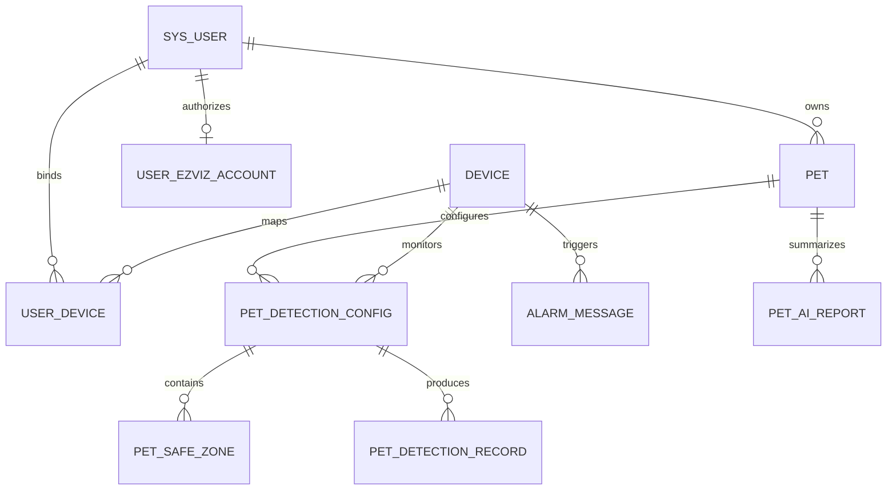

# 数据库设计

系统使用 MySQL 8，建表脚本位于
[`backend/src/main/resources/sql/schema.sql`](../backend/src/main/resources/sql/schema.sql)。
当前共 10 张业务表。

## 核心关系

## 表说明

| 表名 | 用途 | 关键约束或索引 |
|------|------|----------------|
| `sys_user` | 用户、角色和登录状态 | 用户名唯一 |
| `device` | 本地设备镜像与运行状态 | 设备序列号唯一 |
| `pet` | 用户的宠物档案 | `user_id` 索引 |
| `alarm_message` | 萤石与本地检测告警 | 设备、类型、时间复合索引 |
| `pet_detection_config` | 宠物与设备的检测任务 | 宠物和设备组合唯一 |
| `pet_safe_zone` | 矩形或多边形安全区域 | 检测配置索引 |
| `pet_detection_record` | 每次检测的坐标、截图和结果 | 配置、宠物、设备、时间索引 |
| `pet_ai_report` | AI 事件分析与周期总结 | 用户、宠物、来源、创建时间索引 |
| `user_ezviz_account` | 用户级萤石 OAuth 凭证 | 每个用户一条有效授权账户 |
| `user_device` | 用户与萤石设备的绑定关系 | 用户和设备组合唯一 |

## 设计说明

- 多租户边界以 `user_id` 和 `user_device` 为核心，业务查询还会在服务层做归属校验。
- 安全区域使用百分比坐标，避免绑定到单一视频分辨率。
- 告警保留 `raw_json`，检测记录保留 `ai_result_json`，便于追溯外部平台原始结果。
- 当前 Demo 未声明数据库外键，关联完整性由服务层校验，降低设备同步和演示数据初始化的耦合。
- `schema.sql` 使用 `CREATE TABLE IF NOT EXISTS`，只负责首次建表；已有环境的结构升级应使用 migration SQL。
