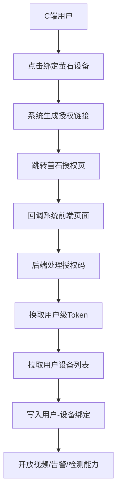
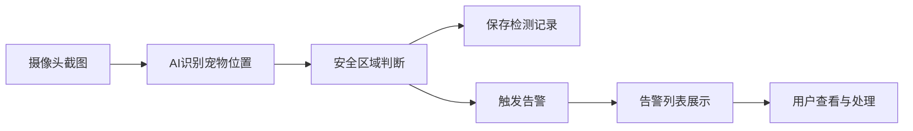

# 期中汇报 Demo 第一阶段验收 PPT 内容整理

项目名称：萤石智宠 - 智能宠物管理系统  
汇报主题：第一阶段 Demo 验收  
汇报风格：以业务问题解决和交付成果为主，技术实现作为支撑说明  
重点内容：已交付功能、C 端萤石授权回调认证链路、下一阶段 AI 自动化总结分析规划

---

## 1. 封面

### 萤石智宠：面向家庭宠物看护的智能监控与告警系统

建议放在 PPT 上：

- 第一阶段目标：完成“用户授权设备 - 视频查看 - 宠物配置 - 异常识别 - 告警追踪”的业务闭环
- 核心价值：让普通摄像头从“被动查看”升级为“主动发现异常并提醒”
- 验收重点：C 端设备授权接入、宠物看护闭环、异常告警和后续 AI 分析能力规划

汇报话术：

> 第一阶段我们重点验证的是系统能不能真正服务宠物看护场景。也就是用户能不能把自己的摄像头接进来，系统能不能围绕摄像头画面完成宠物档案、安全区域、检测记录和异常告警这些核心业务动作。

---

## 2. 业务背景与用户痛点

### 宠物独自在家时，用户需要的不只是“看一眼”

建议放在 PPT 上：

- 用户不在家时，很难持续关注宠物状态
- 普通摄像头只能实时查看，无法主动判断宠物是否异常
- 设备、录像、告警、宠物信息通常是割裂的，用户很难复盘事件
- 宠物异常行为需要从大量画面中筛选，人工成本高

本阶段解决方向：

- 让用户先完成自己的摄像头授权接入
- 把摄像头画面和宠物档案、安全区域绑定起来
- 将检测结果、异常事件和告警沉淀为可查询记录
- 为下一阶段 AI 自动化总结、分析和建议打基础

---

## 3. 第一阶段验收目标

### 先把核心服务链路跑通

建议放在 PPT 上：

| 验收目标 | 业务意义 |
|---|---|
| 用户可以登录系统 | 建立用户身份和数据归属 |
| 用户可以授权绑定萤石设备 | 接入真实 C 端摄像头资源 |
| 用户可以查看设备与视频 | 支撑实时看护和事后回放 |
| 用户可以维护宠物档案 | 让设备监控对象业务化 |
| 用户可以配置安全区域 | 把“宠物不能去哪里”变成系统规则 |
| 系统可以生成检测记录 | 异常判断有数据可追溯 |
| 系统可以产生告警 | 从被动查看变成主动提醒 |

汇报话术：

> 第一阶段不是追求一次性做完所有高级能力，而是先让用户、设备、宠物、检测、告警之间形成闭环。只要这个闭环成立，后续 AI 总结、趋势分析和自动报告才能有数据基础。

---

## 4. 已交付功能总览

### 第一阶段已经交付的业务能力

建议放在 PPT 上：

| 业务模块 | 已交付内容 | 可演示点 |
|---|---|---|
| 用户与权限 | 注册、登录、JWT 鉴权、角色区分 | 登录后进入系统，不同角色控制操作权限 |
| C 端设备接入 | 萤石 OAuth 授权、回调认证、设备绑定、授权状态查询、解绑/撤销授权 | 用户发起授权后完成设备绑定 |
| 设备管理 | 设备同步、设备列表、详情、启用/禁用、编辑、删除 | 查看当前用户可用设备 |
| 视频服务 | 直播预览、云录像查询、回放地址获取 | 展示实时画面和回放能力 |
| 宠物档案 | 宠物新增、编辑、删除、列表 | 建立被看护宠物对象 |
| 安全区域 | 矩形/多边形区域绘制、区域保存、区域列表 | 画出宠物允许活动范围 |
| 宠物检测 | 手动检测、定时检测、检测记录保存 | 看到宠物坐标、截图、是否越界 |
| 告警管理 | 萤石云告警、本地 AI 告警、未读数、筛选、已读、删除 | 查看异常事件列表 |
| AI 助手 | 宠物行为分析、健康建议、自由问答 | 提供辅助解释和建议 |

---

## 5. 重点交付：C 端萤石授权回调认证

### 让普通用户可以接入自己的摄像头

建议放在 PPT 上：

- 用户在系统内点击“绑定萤石设备”
- 系统生成萤石授权地址，并带上当前用户身份标记
- 用户跳转到萤石完成授权和设备选择
- 萤石回调到系统前端页面，前端承接授权参数
- 前端把 `authCode`、`state`、`deviceSerials`、`deviceTrustId` 交给后端
- 后端使用授权码换取用户级 token
- 后端拉取用户授权设备列表，并写入本地绑定关系
- 用户回到设备页后即可看到已授权设备

业务价值：

- C 端用户不需要管理员手工录入设备
- 每个用户只看到自己授权的摄像头
- 授权、绑定、撤销形成闭环，符合真实用户使用流程
- 后续直播、录像、截图、AI 检测都基于这个授权关系展开

---

## 6. C 端回调认证链路说明

### 授权不是一次跳转，而是一条完整的设备托管链路

建议放在 PPT 上：

已实现细节：

- 使用 `state` 参数关联当前系统用户，防止回调后无法识别归属
- 支持前端回调模式：萤石回调到 `/oauth/ezviz/callback`，前端再调用后端完成绑定
- 支持后端回调兜底：后端 `/api/ezviz/oauth/callback` 可直接接收萤石回调
- 保存用户授权账号信息，包括 accessToken、refreshToken、过期时间和 deviceTrustId
- 支持 token 过期刷新，减少用户重复授权
- 支持查询授权状态、解绑单个设备、撤销整体授权

汇报话术：

> 这部分是第一阶段比较关键的交付点。因为只有把 C 端用户自己的设备安全接入进来，后面的直播、回放、告警和 AI 检测才不是演示数据，而是能落到真实设备上的业务能力。

---

## 7. 设备与视频看护能力

### 从“接入设备”到“能看、能回放”

建议放在 PPT 上：

- 设备列表展示当前用户可访问设备
- 支持设备状态管理，区分在线、离线、禁用等状态
- 支持获取实时直播地址，用于远程看护
- 支持按时间范围查询云录像
- 支持获取云录像回放地址，用于异常复盘

业务价值：

- 用户可以确认哪些摄像头已经接入系统
- 用户可以实时查看宠物所在环境
- 出现告警后，可以回看对应时间段画面
- 为后续“AI 自动生成事件摘要”提供视频和时间线基础

---

## 8. 宠物档案与安全区域配置

### 把摄像头画面变成宠物看护规则

建议放在 PPT 上：

- 支持宠物档案管理：名称、类型、年龄、性别、头像/备注
- 支持为某个宠物绑定某个摄像头形成检测配置
- 支持配置告警冷却时间和异常判断阈值
- 支持在画布上绘制矩形或多边形安全区域
- 区域坐标采用百分比存储，适配不同画面分辨率

业务价值：

- 系统不只是“管理设备”，而是围绕具体宠物建立看护对象
- 用户可以用可视化方式定义“安全范围”
- 后续检测结果可以直接判断“宠物是否离开允许区域”

汇报话术：

> 对用户来说，他不需要理解坐标和算法，只要在画面上圈出宠物应该待的区域。系统后面会把这个区域用于自动判断和告警。

---

## 9. 检测记录与告警闭环

### 从异常发现到事件追踪

建议放在 PPT 上：

已交付能力：

- 系统定时对启用配置执行检测
- 用户也可以手动触发检测，便于现场 Demo 和人工复核
- 检测记录保存宠物坐标、检测时间、截图、是否在安全区域内
- 越界时生成本地 AI 告警
- 告警支持未读数、筛选、详情查看、标记已读和删除
- 告警来源兼容萤石云端告警和系统本地 AI 告警

业务价值：

- 用户不用一直盯着视频画面
- 每次异常都有记录可查
- 告警、设备、宠物和截图可以关联复盘
- 后续可以基于历史记录生成自动分析报告

---

## 10. 异常行为分析能力

### 第一阶段已具备基础规则判断

建议放在 PPT 上：

| 异常类型 | 当前判断方式 | 对用户的价值 |
|---|---|---|
| 宠物长时间未出现 | 一段时间内没有检测到宠物 | 提醒宠物可能离开画面或进入盲区 |
| 宠物异常活跃 | 短时间内多次大幅移动 | 提醒宠物可能受惊、焦躁或异常兴奋 |
| 宠物长时间静止 | 多次检测位置变化很小 | 提醒用户关注宠物状态 |
| 宠物越界 | 宠物位置不在安全区域内 | 提醒宠物进入不希望活动的区域 |

业务说明：

- 当前阶段以可解释规则为主，便于验收和调参
- 每类异常都有冷却机制，避免短时间重复告警
- 异常分析结果统一进入告警体系，用户不需要切换多个入口

---

## 11. AI 助手已交付能力

### 先完成辅助解释，下一阶段升级为自动总结

建议放在 PPT 上：

- 支持宠物行为分析：用户输入情况后，AI 给出分析建议
- 支持健康建议：围绕宠物类型和状态生成照护建议
- 支持自由问答：用户可以询问宠物看护相关问题
- 后续可接入检测记录和告警数据，形成自动化分析入口

第一阶段定位：

- AI 助手目前主要是“辅助解释”
- 它帮助用户理解宠物状态，但不替代专业医疗判断
- 重点价值是验证大模型接入链路和产品交互入口

---

## 12. 技术栈简要说明

### 技术服务于业务闭环，不作为汇报重点展开

建议放在 PPT 上：

| 层级 | 选型 | 支撑的业务能力 |
|---|---|---|
| 前端 | React + TypeScript + Ant Design | 管理后台、设备绑定、视频播放、安全区域绘制 |
| 后端 | Java 17 + Spring Boot 3 | 用户认证、设备授权、业务规则、检测和告警 |
| 数据库 | MySQL + MyBatis-Plus | 用户、设备、宠物、检测记录、告警数据存储 |
| 视频与设备 | 萤石开放平台 | OAuth 授权、设备列表、直播、回放、截图、AI 检测 |
| AI 能力 | DeepSeek / Spring AI | 宠物分析、健康建议、问答和后续自动总结 |
| 部署支撑 | Docker Compose | Demo 环境快速启动 |

汇报话术：

> 技术选型主要围绕第一阶段快速落地和稳定演示来做，没有引入过重的微服务或中间件。重点是保证用户设备能接入、业务链路能跑通、数据能沉淀下来。

---

## 13. Demo 推荐演示流程

### 按用户真实使用路径演示

建议现场顺序：

1. 登录系统，展示总览页
2. 进入设备绑定页，说明 C 端萤石授权入口
3. 展示授权状态和已绑定设备列表
4. 进入设备列表或详情，展示设备信息
5. 打开实时预览，展示摄像头看护能力
6. 打开宠物档案，展示被看护对象
7. 打开检测配置，说明宠物与摄像头绑定关系
8. 进入安全区域编辑器，演示区域绘制
9. 手动触发检测，展示检测结果
10. 打开检测记录和告警列表，展示异常追踪
11. 打开 AI 助手，展示辅助分析入口

如果时间有限，优先演示：

- C 端授权绑定设备
- 实时预览
- 安全区域配置
- 手动检测和告警记录
- AI 助手

---

## 14. 第一阶段交付总结

### 业务闭环已经成立

建议放在 PPT 上：

- 已完成用户体系，能够区分用户身份和操作权限
- 已完成 C 端萤石授权回调认证，用户可接入自己的摄像头
- 已完成用户设备绑定，数据按用户设备范围隔离
- 已完成直播预览和云录像回放，为看护与复盘提供入口
- 已完成宠物档案、安全区域和检测配置
- 已完成检测记录、越界告警和异常行为告警
- 已完成 AI 助手基础能力，为下一阶段自动分析做准备

一句话总结：

> 第一阶段已经从业务上跑通了“用户接入设备、系统识别异常、用户查看和处理告警”的核心闭环。

---

## 15. 当前阶段边界

### 已能验收 Demo，但还不是完整商用版本

建议放在 PPT 上：

- 当前重点验证单用户/多设备的基础看护场景
- 异常行为判断以规则和阈值为主，后续需要结合真实数据持续优化
- 告警目前主要在系统内展示，主动推送能力待完善
- AI 助手目前以用户主动提问为主，尚未形成自动日报/周报
- 多宠物身份识别、长期行为画像、家庭成员协同等能力仍在下一阶段规划内

汇报话术：

> 这些边界是我们主动控制范围的结果。第一阶段先证明闭环成立，下一阶段再把它做得更智能、更主动、更贴近真实家庭使用。

---

## 16. 下一阶段计划：AI 自动化总结分析

### 从“用户查看告警”升级为“系统主动总结”

建议放在 PPT 上：

| 方向 | 计划能力 | 用户价值 |
|---|---|---|
| 自动日报/周报 | 汇总宠物出现次数、活跃时段、异常次数、告警处理情况 | 用户不用逐条翻记录 |
| 异常事件总结 | 自动解释某次告警前后的检测变化和可能原因 | 降低用户理解成本 |
| 行为趋势分析 | 统计活跃度、静止时长、离开安全区频率 | 帮助发现长期变化 |
| 个性化建议 | 结合宠物档案、历史记录和告警类型生成照护建议 | 从告警走向陪伴式看护 |
| 自动报告生成 | 一键生成可分享的宠物看护报告 | 方便家庭成员或医生参考 |

规划说明：

- 第一阶段已经沉淀了检测记录、告警、设备和宠物档案
- 下一阶段将把这些结构化数据输入 AI 分析模块
- 目标是让系统从“记录异常”升级为“解释异常、总结趋势、给出建议”

---

## 17. 下一阶段计划：告警与运营闭环

### 让异常信息真正触达用户

建议放在 PPT 上：

- 增加消息推送：短信、邮件、企业微信、Webhook 或 App 通知
- 支持告警分级：普通提醒、重要告警、紧急告警
- 支持告警处理状态：待处理、已确认、误报、已关闭
- 支持告警关联回放：点击告警可直接查看对应时间段录像
- 支持家庭成员协同：多用户共享同一宠物和设备看护结果

业务价值：

- 用户不需要主动打开系统才能知道异常
- 告警处理过程可追踪
- 系统更接近真实产品而不是单纯后台 Demo

---

## 18. 下一阶段计划：体验与识别能力优化

### 提升稳定性、准确性和易用性

建议放在 PPT 上：

- 优化安全区域编辑体验，支持区域模板和快捷调整
- 增加检测结果可视化回放，在画面上叠加宠物位置和安全区域
- 基于真实使用数据调整异常阈值，降低误报和漏报
- 支持多宠物场景，逐步探索宠物身份区分
- 增加趋势图表，如活动热力图、告警趋势、设备在线率
- 补充集成测试和端到端测试，提升演示和部署稳定性

---

## 19. 建议 PPT 精简目录

如果控制在 10-12 页，可使用以下结构：

1. 封面
2. 业务背景与用户痛点
3. 第一阶段验收目标
4. 已交付功能总览
5. 重点交付：C 端萤石授权回调认证
6. C 端授权链路流程图
7. 设备与视频看护能力
8. 宠物档案、安全区域与检测告警闭环
9. AI 助手与当前异常分析能力
10. 第一阶段交付总结与边界
11. 下一阶段：AI 自动化总结分析
12. 下一阶段：告警触达、体验优化与产品化

---

## 20. 现场 Demo 检查清单

演示前建议确认：

- 默认管理员账号可登录：`admin / 123456`
- 后端服务可访问：`http://localhost:8080`
- 前端服务可访问：开发环境 `http://localhost:5173`，Docker 环境 `http://localhost`
- MySQL 已导入初始化表结构
- 萤石 AppKey、AppSecret、回调地址配置正确
- 准备至少一个已授权或可授权的萤石设备
- 准备至少一个宠物档案和检测配置
- 提前准备安全区域、检测记录和告警数据，避免现场接口波动
- 如需展示 AI 助手，确认 `LLM_API_KEY` 已配置

---

## 21. 结尾页

### 阶段结论

建议放在 PPT 上：

> 第一阶段已完成智能宠物看护系统的核心业务闭环，重点打通了 C 端用户设备授权接入、视频看护、宠物档案、安全区域、检测记录和异常告警。下一阶段将围绕 AI 自动化总结分析、告警主动触达和产品体验优化，把系统从“能发现异常”进一步升级为“能理解异常、总结趋势、主动建议”的智能看护助手。

